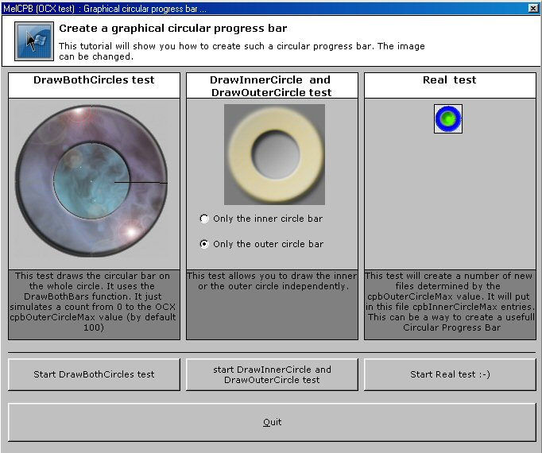



## MelCPB Circular ProgressBar OCX

### Description

The previous submitted code concerning the graphical Circular ProgressBar, has turned into an OCX. Just try it, and report the bugs or strange behaviour. Your comments concerning some upgrades are also welcome. There's a test project included. A part of this of this test may show you how to use the OCX while writing files (some asked for it, so here it is).

The pictures can easily be changed, the size is free (jpg, gif or bmp files allowed).

The main functions are commented in the test project.

Let's try and report.
 
### More Info
 

             |
---                |---
**Submitted On**   |2005-01-16 02:56:30
**By**             |[brainwasher](https://github.com/Planet-Source-Code/PSCIndex/blob/master/ByAuthor/brainwasher.md)
**Level**          |Advanced
**User Rating**    |4.8 (19 globes from 4 users)
**Compatibility**  |VB 6\.0
**Category**       |[Miscellaneous](https://github.com/Planet-Source-Code/PSCIndex/blob/master/ByCategory/miscellaneous__1-1.md)
**World**          |[Visual Basic](https://github.com/Planet-Source-Code/PSCIndex/blob/master/ByWorld/visual-basic.md)
**Archive File**   |[MelCPB\_Cir1840421162005\.zip](https://github.com/Planet-Source-Code/brainwasher-melcpb-circular-progressbar-ocx__1-58298/archive/master.zip)

